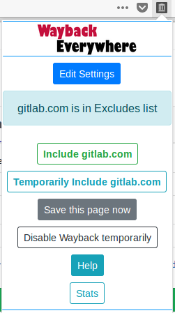
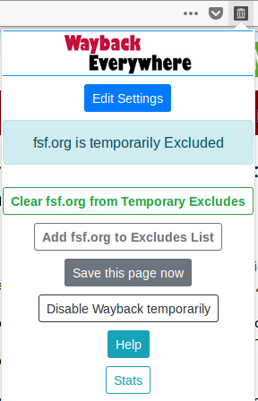
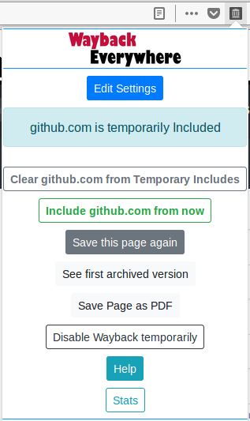

# Wayback Everywhere

Install in Firefox / Firefox for Android / GNU Icecat : [addons.mozilla.org](https://addons.mozilla.org/en-US/firefox/addon/wayback-everywhere)

Install in Chrome/ Brave / Vivaldi / Other chromium browsers : [Chrome Webstore](https://chrome.google.com/webstore/detail/wayback-everywhere/heienainncnjjejmamdkmbbfmblpffjj)

Install in Opera : [Opera addons store](https://addons.opera.com/en/extensions/details/wayback-everywhere/)

Install in Brave (Muon based version) : Use this method [Chrome Extension in Brave](https://medium.com/@jonathansampson/testing-chrome-extensions-in-brave-8e25d1f7386d)

## What is Wayback Everywhere?

Wayback Everywhere is a browser extension/addon that allows you to automatically redirect all pages to Internet Archive's [Wayback Machine](https://web.archive.org) except the site (domains) that are in 'Excludes' List, and auto-save to Wayback Machine if a page is not yet archived.

Examples:

-   http://<i></i>example.org --> https://<i></i>web.archive.org/web/2/https://<i></i>example.org
-   If http://<i></i>gnu.org is in 'Excludes' List --> http://<i></i>gnu.org
-   If a page is not yet archived when loaded, --> https://<i></i>web.archive.org/save/&lt;URL&gt;

Over time (perhaps a few days of usage..), you can build this 'Excludes' list to suit your browsing habits. More information on 'Excludes' list available here [Exclude List](#excludes-list) and it comes bundled with ~800 sites in default Excludes to help provide starting point to the user - Read more : [Default Excludes list](#default-excludes-list)

  
  
  

## Features

-   **Auto-Save pages / Auto-exclude sites** \- Addon tries to detect messages displayed by Wayback Machine and either Saves a available page to Wayback or Adds the site to Exclude list based on the error message. More information here: [Auto-save pages/ Auto-exclude sites](#auto-save-pages-auto-exclude-sites)
-   **Popup menu** \- Use the Popup menu to add/remove site from Excludes list, temporarily disable WaybackEverywhere addon and open Settings and Help Pages. More information on Popup Menu available here [Popup Menu](#popup-menu)
-   **Settings Page** \- Settings page allows you to add or remove a site from the excludes list, and also do factory reset. If you are interested, you can enable console logging from here. More information on Popup Menu available here [Settings Page](#edit-settings)
-   **Auto-enable Reader mode for Archived pages** \- From settings page, enable the option to automatically open "Reader mode" for archived pages which support Firefox's reader mode.
-   **Load all links in an archived page as new tabs** \- From Settings page, enable the option to open all links of an archived page based on a "selector" that user enters in popup menu - intended to be used for opening all "chapters" in new tabs when reading a html book format pages. Example : Wikisource or wikibooks. EXPERIMENTAL FEATURE disabled by default. [open-all-links-in-a-archived-page-as-new-tabs](#open-all-links-in-a-archived-page-as-new-tabs)
-   **Auto-exclude download links** - Addon tries to detect URLs that end with a common file extension automatically excludes those URLs so user can download directly from live site.
-   **Automatic Temporary exclude for some sites** - Addon tries to automatically add sites to temporary excludes and load live site when the user clicks a URL that has some words like 'login' or 'register' so he/she can login and use the live site without having to manually exclude.

## Auto-Save pages / Auto-exclude sites

-   **Auto-Save Page to Wayback Machine** \- When WaybackMachine site throws error message that says "This page is available on the web, save this page to Wayback to make it more complete", the addon automatically loads the Save page url as https://web.archive.org/save/ <URL>
-   **Auto-add to Excludes List** \- When Wayback Machine site throws error message that says it cannot load a page due to the site being excluded from Wayback Machine or if the site excluded itself from Wayback using Robots.txt file, the addon automatically detects this error message and puts the site (domainname) in Excludes list. And then it loads the live webpage. This helps the user to build her Excludes list Automatically over few days of usage.

## Popup Menu

-   Popup Menu appearance changes based on in which page you click on the Popup Menu
-   "Temporary" Exclude/Includes - You can temporarily exclude/include a site from popup menu.
-   Once a page is temporarily excluded/incldued, popup menu show new buttons - to clear temporary rule or apply the changes from popup menu.
-   If this is not done, temporary excludes/includes are cleared back when the browser is closed and started again.

**When viewing an archived page**

**When viewing an excluded site**

**When viewing a temporarily excluded site**

**When viewing a temporarily included site**

## Excludes List

-   Sites (hostnames) in the Excludes list are excluded from routing to Wayback Machine.
-   You can use popup menu buttons to add/remove from this Excludes list to suit your browsing habits
-   Temporary exclude/include 'remembers' the selection until the browser is restarted. (See Popup menu)
-   You also have the option to add or remove from Excludes list via Settings Page
-   Some Wayback Machine site's error messages like "Site excluded" - the addon can automatically detects this and adds the site (hostname) to Excludes list. This helps you in building a Excludes list without manual effort. Read more here : [Auto-detect Wayback Machine Error Messages](#auto-detect-wayback-machine-error-messages)
-   The 'Excludes' list excludes at domain level, including subdomains - for example, if we exclude _*.google.*_ \- this results in redirect rules not applying to _all_ Google sites - the ones that have 'google' in the url (i.e no redirection to wayback machine) happens across all google domains - _docs.google.com, drive.google.com, google.de, google.co.in_ and so on.
-   Now, in those domains, if there are "public pages" (like Blog posts) which do _not_ need login to view, you can use the popup menu's "Save Page Now" button to save that page alone to the wayback machine - More info on popup menu's features here [Popup Menu](#popup-menu)

## Edit Settings

-   Click "Edit Settings" from Popup Menu to open Settings Page.
-   Settings page lets you view Existing Excludes list. and add or remove from excludes list manually by using the buttons provides
-   This page also lets you reset the Excludes list back to the default one provided during addon installation if the user wishes for the same. More information on the default list : [Default Excludes list provided during install](#default-excludes-list)
-   From settings page, you can enable the option to automatically open "Reader mode" for archived pages which support Firefox's reader mode.
-   You can export and import settings from this page. More information on this here : [Export and Import Settings](#exportimport-settings)
-   Additionally, curious users may enable Logging on the checkbox provided to view system logs in Browser console.

## Default Excludes List

-   Upon install, a set of predefined rules are loaded into the Excludes List. This is to provide a starting point for the users. This list is prepared by the developer(s) of this addon on purely technical basis:
-   Some sites that are excluded from Wayback Machine - quora.com for example
-   Some sites that use robots.txt file on server to exclude themselves from Wayback Machine - smithsonianmag.com, for example
-   Some sites that may need login, as Wayback Machine archives public pages only. For example, docs.google.com or paypal.com , or some sites that host video content which may not work in Wayback machine Archived version like youtube.com or vimeo.com
-   Some sites that may not work fine with Wayback Machine - ft.com for example.
-   Some URL shortener sites.
-   Some Search engines to help the user avoid seeing Wayback redirects when she searches
-   Some reserved addresses like 127.0.0 _ and 0.0.0_ so that user can browse these without routing
-   Some online education learning course sites as they host video content and also need login to work
-   Some cloud storage sites as they need login anyway (Dropbox, WeTransfer,Box..)
-   Some video streaming (netflix..) sites and live streaming sites (Periscope..)
-   Some audio podcast sites
-   Some Language learning sites (Duolingo..) as they need login to work.
-   Download links in which the URL ends with 100 common extensions get auto-excluded so you can begin the download from within archived page (example.com/download/file.zip or /file.doc will get auto-excluded only for just the download link)
-   Some video conference site links like skype, sococo, jitsi and few other online meeting sites.
-   Some online office suite sites like office365, zoho and onlyoffice.
-   Some mailerlist domains so that you can easily unsubscribe from marketing emails ;-)
-   Some online radio sites.
-   Some crowdfunding sites.
-   Some "what is my ip" type sites.
-   Some chat apps like whatapp web and telegram web.
-   Some travel and hotel booking sites
-   Some online payment sites like flattr and liberapay and buymeacoffee.

P.S : There's no other agenda behind this bundled list made available during install :)

If user wishes to reset his Excludes back to the ones provided by Developer, she can do so from the Settings Page

TODO : [TODO](TODO) and [issues](https://gitlab.com/gkrishnaks/WaybackEverywhere-Firefox/boards?=)

## Export/Import Settings

-   In Settings page, you can choose to Export your settings to a .JSON file
-   You can also import your settings using a previously exported JSON file
-   Addon tries to do some validation on the imported JSON before it saves settings to Disk. But we advise not to manually edit the exported JSON before importing to avoid errors

## Open all links in a archived page as new tabs

-   This feature is for advanced users only and is in EXPERIMENTAL STATE, hence not enabled by default. Please read the below before using it
-   From Settings page has an option to enable "open all links in page" button to Popup menu.
-   Once enabled, this adds a button and input field to Popup Menu.
-   You need to enter a selector in input field before you click Open all links.
-   For example, open this page [Free as in Freedom - Book in wikisource](<https://web.archive.org/web/20180429164845/https://en.wikisource.org/wiki/Free_as_in_Freedom_(2002)>)
-   All the chapters listed have "Chapter" in the URLs. So, open popup menu and enter "Chapter" as selector and click "Open All Links" button - this will open all the chapter links in new tabs
-   This may cause your browser to freeze until all tabs are loaded - Use Selector wisely to only open the links that you really want to open in new tabs

## Details on Stats

-   Stats are displayed in popup menu. Stats include total redirects and total pages saved to Wayback Machine using the addon.
-   Once a page is redirected to wayback machine, all links in the page get web.archive.org/web/2\* prefixed by Wayback Machine. Clicking on any link within an archived page will <em>not</em> add to the redirected counts.
-   Saved counts are updated for both auto-save and also manual saves using "save this page" button in popup menu.
-   Since the stat counts are per-device (per-install) statistics, it is not included in Export/Import setting feature.
-   To avoid multiple disk writes, stats are stored to disk once every four minutes. It's fine if browser is closed before a four minute window as stats are not a critical value :)

## Advanced Settings page

-   For ADVANCED USERS only : There are some settings for advanced users in a page that's not directly accessible from Addon UI pages.
-   To open the advanced settings page, open Settings page or help page -> adjust the URL to <addonID>/advanceduser.html
-   In the page, you can clear all Excludes, set stats to Zero, and remove all the fitlers
-   You also have the option to add to filters or remove a specific filter - use this carefully. Avoid using this add filter feature if you aren't sure what UTM or similar things are.

## License

The WaybackEverywhere addon is licensed under GPLv3 license. Refer the full license here : [License](LICENSE)

\-\-\-

Wayback Everywhere - a browser addon/extension to redirect all pages to archive.org's Wayback Machine except the ones in Excludes List

Copyright (C) 2018 Gokulakrishna K S  
This program is free software: you can redistribute it and/or modify it under the terms of the GNU General Public License as published by the Free Software Foundation, either version 3 of the License, or (at your option) any later version.  
This program is distributed in the hope that it will be useful, but WITHOUT ANY WARRANTY; without even the implied warranty of MERCHANTABILITY or FITNESS FOR A PARTICULAR PURPOSE. See the GNU General Public License for more details.  
You should have received a copy of the GNU General Public License along with this program. If not, see https://www.gnu.org/licenses/

\-\-\-

The developer of this addon/extension is _NOT_ affliated with the Internet Archive (archive.org or web.archive.org)

Privacy Policy in one line : We do not collect your data. Detailed privacy policy page : [Privacy Policy](Privacy%20Policy)

## Credits and Acknowledgements

-   This addon is built based on the 'Redirector' addon developed by [Einar Regilsson](http://einaregilsson.com/redirector). He published its sourcecode under MIT license.
-   The developer of this addon is _NOT_ affliated to Internet Archive (archive.org) or its Wayback Machine (web.archive.org)- but I thank them for making web.archive.org a freely available resource on the internet for the benefit of general public, and the commons.
-   This addon uses the icons from https://addons.mozilla.org/en-US/firefox/addon/wayback-machine_new/. Some parts of popup.html were also taken from this addon.
-   This addon uses libraries/frameworks - AngularJS, Bootstrap (CSS and JS), FontAwesome, and JQuery. These are governed by their respective licenses. You can refer to their websites for the same.

---

Developed by Gokulakrishna. [gokulakrishnaks@gmail.com](mailto:gokulakrishnaks@gmail.com?subject=WaybackEverywhere%20Feedback) Twitter : [@gkrishnaks](https://twitter.com/gkrishnaks)
